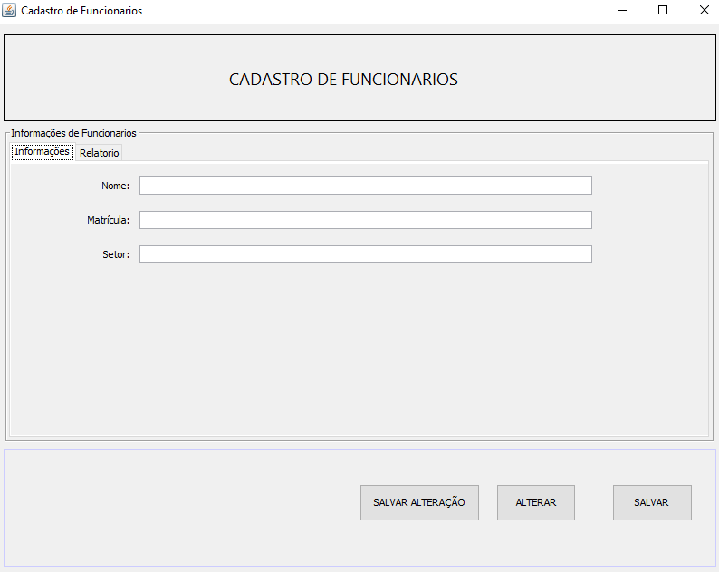
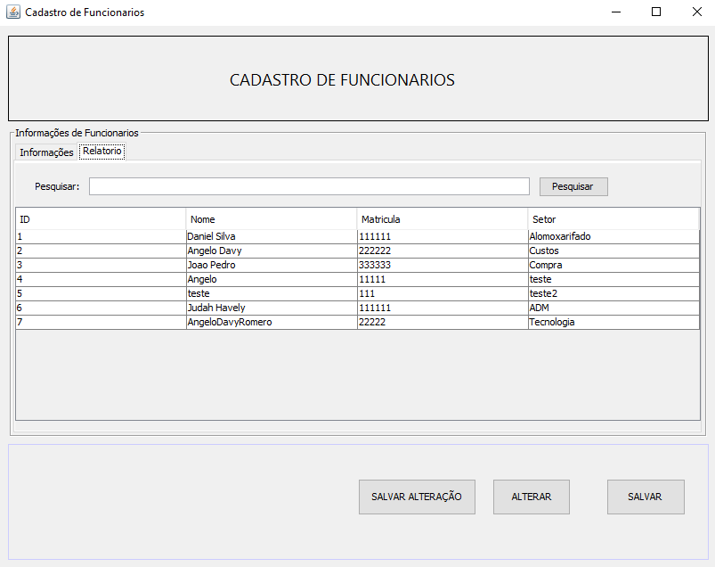

<h1 align="center" style="font-weight: bold;">Gestão Funcionário 💻</h1>

<p align="center">
 <a href="#tech">Technologies</a> • 
 <a href="#started">Getting Started</a> • 
  <a href="#colab">Collaborators</a> •
 <a href="#contribute">Contribute</a>
</p>

<p align="center">
    <b>Sistema de cadastro de funcionário desenvolvido com Java e JavaFX/Swing. Permite cadastro, consulta, edição e exclusão de funcionários, além de relatórios e autenticação de usuários.
</b>
</p>

<h2 id="layout">🎨 Layout</h2>

<p align="center">
    
    
</p>

<h2 id="technologies">💻 Technologies</h2>

- Java 8/21
- JavaFX/Swing para interface gráfica
- MySQL/PostgreSQL para banco de dados
- JDBC para conexão com banco de dados

<h3>Prerequisites</h3>

Here you list all prerequisites necessary for running your project. For example:

- [JDK 8+](https://www.oracle.com/br/java/technologies/javase/javase8-archive-downloads.html)
- [Git 2](https://github.com)

<h3>Cloning</h3>

How to clone your project

```bash
git clone https://github.com/AngeloDavy/FuncionarioCadastroJavaFX
```

<h3>Starting</h3>

How to start your project

```bash
cd project-name
npm some-command-to-run
```

Here you will explain how other developers can contribute to your project. For example, explaining how can create their branches, which patterns to follow and how to open an pull request

1. `git clone https://github.com/AngeloDavy/FuncionarioCadastroJavaFX`
2. `git checkout -b feature/NAME`
3. Follow commit patterns
4. Open a Pull Request explaining the problem solved or feature made, if exists, append screenshot of visual modifications and wait for the review!

<h3>Documentations that might help</h3>

[📝 How to create a Pull Request](https://www.atlassian.com/br/git/tutorials/making-a-pull-request)

[💾 Commit pattern](https://gist.github.com/joshbuchea/6f47e86d2510bce28f8e7f42ae84c716)